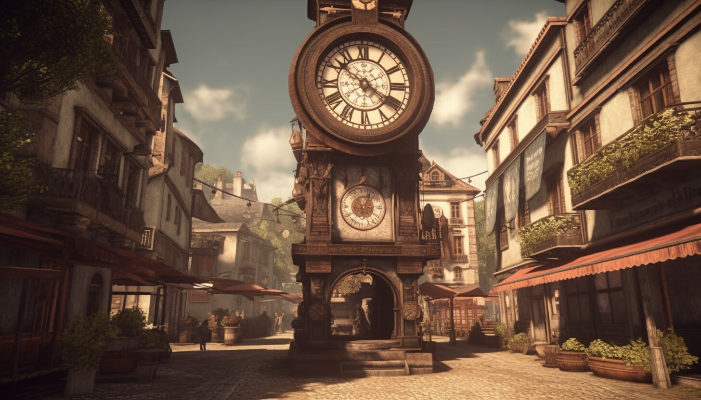

## The Clockwork Town of Tempora

### Background:

In the mechanical town of Tempora, everything operates on clockwork and precise timing. At the heart of the town is the Grand Clock Tower, responsible for keeping time for all the town's activities. However, over the years, some smaller clocks in the town have started to drift away from the accurate time.

### Objective:

Your task is to create a system that checks all the clocks in the town and synchronizes them with the Grand Clock Tower. You'll be given a list of times from various clocks around the town, and you must determine how many minutes each clock is ahead or behind the Grand Clock Tower's time.

### Specifications:

1. **Clock Data:**
    - The clock times are provided in a 24-hour format.
    - The Grand Clock Tower is at 15:00.
    - Clock times around town:
        - Clock 1: 14:45
        - Clock 2: 15:05
        - Clock 3: 15:00
        - Clock 4: 14:40

2. **Time Analysis and Output:**
    - You need to determine how many minutes each clock is ahead or behind the Grand Clock Tower.
    - The result should be an array of integers representing the time difference in minutes. Positive values indicate the clock is ahead, and negative values indicate it's behind.

### Constraints:

- Use GitHub Copilot and write the simulation in any language you'd like.
- Focus on clear and concise code. Ask GitHub Copilot/Chat, "How can I make this code more readable and maintainable?".
- Creating a visual representation for the clocks is optional but encouraged if you have time.

### Summary of High-Level Steps to Perform:

1. Parse the time data for each clock and the Grand Clock Tower.
2. Calculate the difference in minutes between each clock and the Grand Clock Tower.
3. Output the list of time differences.