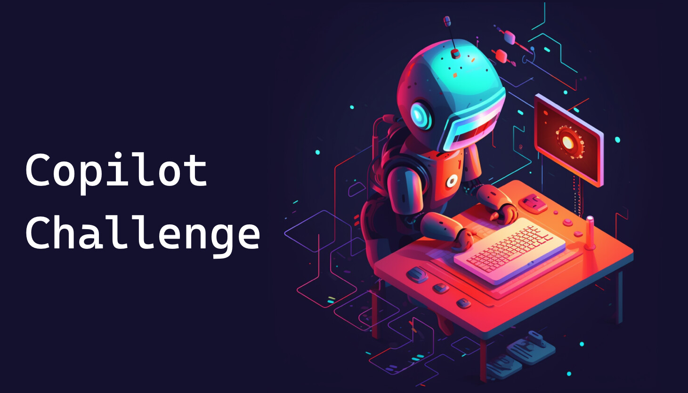
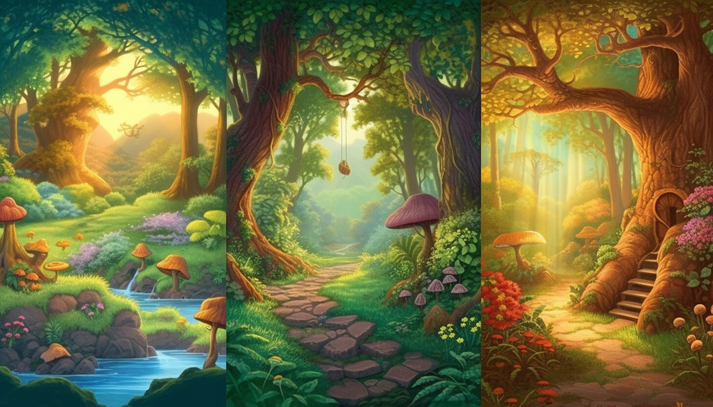

# Copilot Challenge



Welcome to the Copilot Challenge! This challenge is all about learning new concepts and languages by using [GitHub Copilot](https://github.com/features/copilot) to help you write code.

To get started, walk through our [warmup challenge](./Challenges/StartHere.md) to ensure that you have the [GitHub Copilot](https://marketplace.visualstudio.com/items?itemName=GitHub.copilot) extension installed and are signed into GitHub in VS Code.

## Choose Your Own Copilot Adventure

<picture>
    
</picture>

### 1. Enter the Challenge Arena

To get started, enter the "challenge arena" by clicking the button below. 

    [](https://github.com/codespaces/new?hide_repo_select=true&ref=main&machine=standardLinux32gb&devcontainer_path=.devcontainer%2Fdevcontainer.json&location=WestUs2)

If you'd prefer to work locally, follow the steps below:

- Select the **Fork** button at the top of the page to fork the repository to your GitHub account.
- Clone the repository to your local machine and open it in VS Code:

    ```bash
        # Run the following command in your terminal
        git clone <YOUR_REPOSITORY_URL>
    ```

### 2. Choose a Copilot Challenge

- [Warmup Challenge](./Challenges/StartHere.md) - Start here if you're new to GitHub Copilot.
- Beginner Challenges
    - [The Clockwork Town of Tempora](./Challenges/1-Beginner/The-Clockwork-Town-of-Tempora.md)
    - [The Magical Forest of Algora](./Challenges/1-Beginner/The-Magical-Forest-of-Algora.md)
- Intermediate Challenges
    - [The Celestia Alignment of Lumoria](./Challenges/2-Intermediate/The-Celestial-Alignment-of-Lumoria.md)
    - [The Legendary Duel of Stonevale](./Challenges/2-Intermediate/The-Legendary-Duel-of-Stonevale.md)
    - [The Scrolls of Eldoria](./Challenges/2-Intermediate/The-Scrolls-of-Eldoria.md)
- Advanced Challenges
    - [The Gridlock Arena of Mythos](./Challenges/3-Advanced/The-Gridlock-Arena-of-Mythos.md)

### 3. Start Coding

Read Your Copilot Challenge description, the high-Level steps to perform, and the GitHub Copilot hints to help you write your code.

- Use [GitHub Copilot](https://marketplace.visualstudio.com/items?itemName=GitHub.copilot) and/or [GitHub Copilot Chat](https://marketplace.visualstudio.com/items?itemName=GitHub.copilot-chat) to help you write the code for the challenge. You can use any language you'd like. Try learning a new language if you're up for the challenge (more on that below)!

### 4. Submit Your Challenge Solution

- Once you've completed the challenge, submit a pull request to this repository with your solution. Be sure to include the `challenge title` in your pull request description as well as your code file(s). 
- Leave any comments in your code to explain your thought process and show prompts that [GitHub Copilot](https://github.com/features/copilot) used to help you out.
- If you have any feedback, please open an issue in the repo and share what you found (good or bad). We'd love to hear from you!

## Next Steps: Learn a New Language or Create a UI for Your Challenge


Once you've completed your first challenge, try it again but this time use GitHub Copilot to complete the challenge using a language that's new to you. For example, if you normally write code in C#, use Copilot to help you solve the challenge using Python or another language you'd like to learn more about.

Try creating a UI for your challenge. Use pure HTML/CSS/JavaScript or a library/framework of your choosing. Let GitHub Copilot/Chat help you out with the UI code. If your UI requires images, consider using [Bing Image Creator](https://www.bing.com/create) or another AI image generation service.

## Have a Copilot Challenge Idea? Submit a PR!

Do you have a copilot challenge story/puzzle you'd like to submit for others to go through? We'd love to see it! Please submit a pull request to this repository with your challenge and solution. 

- Add `New Copilot Challenge: [Your Challenge Name]` into the PR title. Replace `[Your Challenge Name]` with the name of your challenge.
- Include if your challenge is at the beginner, intermediate, or advanced level.
- Follow the markdown template used with each challenge in the [Challenges](./Challenges) folder as you create your challenge.
- Provide an image for your challenge (use [Bing Image Creator](https://www.bing.com/create) or another image generator solution).
- Provide a solution using your chosen language. Place all of the code in a single file (to keep things simple) and include it in the PR.

We'll review your submission and merge it into the repo if it meets the criteria.
